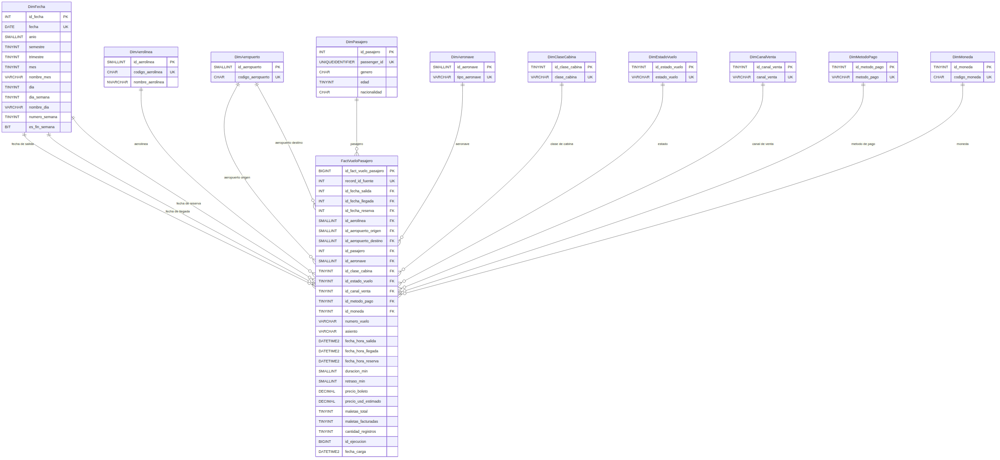

# Práctica 1 - ETL con Python y SQL Server

| Campo | Información |
|---|---|
| Curso | Seminario de Sistemas 2 |
| Universidad | Universidad de San Carlos de Guatemala |
| Facultad | Facultad de Ingeniería |
| Escuela | Escuela de Ciencias y Sistemas |
| Grupo | 6 |

## Descripción

Esta práctica implementa un proceso ETL para transformar un dataset crudo de vuelos en un modelo dimensional preparado para análisis.

El proceso se desarrolló con Python y Microsoft SQL Server. Los datos son extraídos desde un archivo CSV, almacenados inicialmente en una capa de staging, transformados mediante reglas de limpieza y homologación y finalmente cargados en un modelo dimensional en estrella.

Además del proceso ETL, la solución incluye auditoría de ejecuciones, validaciones de integridad, consultas analíticas y un diagrama del modelo dimensional.

---

## Arquitectura general

El flujo implementado es el siguiente:

~~~text
dataset_vuelos_crudo.csv
          |
          v
      EXTRACCION
          |
          v
     stg.VueloRaw
          |
          v
    TRANSFORMACION
          |
          v
   MODELO DIMENSIONAL
          |
          v
 CONSULTAS ANALITICAS
~~~

De forma paralela, las tablas del esquema `audit` almacenan información sobre las ejecuciones y errores del proceso ETL.

La solución utiliza tres esquemas dentro de SQL Server:

- `stg`: conserva los datos crudos provenientes del archivo CSV.
- `dw`: contiene el modelo dimensional utilizado para análisis.
- `audit`: mantiene la trazabilidad de las ejecuciones del ETL y sus posibles errores.

---

# Modelo de Data Warehouse

## Modelo seleccionado

Se utilizó un **modelo en estrella**.

La tabla central es:

~~~text
dw.FactVueloPasajero
~~~

y se relaciona directamente con las siguientes dimensiones:

- `DimFecha`
- `DimAerolinea`
- `DimAeropuerto`
- `DimPasajero`
- `DimAeronave`
- `DimClaseCabina`
- `DimEstadoVuelo`
- `DimCanalVenta`
- `DimMetodoPago`
- `DimMoneda`

Se seleccionó el modelo estrella porque los datos están orientados a un único proceso analítico principal: los registros de pasajeros asociados con reservas y ocurrencias de vuelo.

Este diseño permite mantener las medidas en una tabla de hechos central y consultar los datos utilizando dimensiones descriptivas sin introducir niveles adicionales de normalización que compliquen innecesariamente las consultas.

Frente a un modelo copo de nieve, la estrella simplifica los `JOIN` y facilita las consultas analíticas. Tampoco fue necesario utilizar una constelación, ya que no existen varios procesos de negocio que requieran múltiples tablas de hechos.

## Grano de la tabla de hechos

El grano se definió como:

> Una fila de `dw.FactVueloPasajero` representa un registro fuente de un pasajero asociado con una reserva y una ocurrencia de vuelo.

Por esta razón, un `COUNT(*)` de la tabla de hechos representa cantidad de registros pasajero-vuelo y no debe interpretarse automáticamente como cantidad de vuelos físicos distintos.

## Dimensiones con múltiples roles

El diseño reutiliza algunas dimensiones para diferentes funciones.

`DimFecha` participa tres veces en la tabla de hechos:

- fecha de salida;
- fecha de llegada;
- fecha de reserva.

De forma similar, `DimAeropuerto` participa como:

- aeropuerto de origen;
- aeropuerto de destino.

Este patrón evita crear estructuras duplicadas para entidades que conceptualmente representan la misma dimensión.

---

## Diagrama del modelo

También se incluyen las siguientes versiones del diagrama:

- `docs/modelo_estrella.mmd`: fuente Mermaid editable.
- `docs/modelo_estrella.md`: versión renderizable desde Markdown.
- `docs/modelo_estrella.svg`: versión vectorial.
- `docs/modelo_estrella.png`: versión raster utilizada en esta documentación.

---

# Dataset

El archivo utilizado es:

~~~text
data/dataset_vuelos_crudo.csv
~~~

El dataset contiene:

~~~text
10,000 registros
26 columnas
~~~

Para garantizar que las pruebas se realizaron sobre la misma fuente se calculó el siguiente SHA-256:

~~~text
a3a6b5cc67697a069a7057789accde217ecc580d03098b643db672978abd753e
~~~

Entre los campos disponibles se encuentran información de aerolínea, vuelo, aeropuertos, fechas, estado, pasajero, reserva, canal de venta, método de pago, precio y equipaje.

---

# Proceso ETL

La implementación se encuentra separada en módulos para mantener responsabilidades claras.

## Extracción

La extracción está implementada en:

~~~text
src/extract.py
~~~

El CSV se lee inicialmente como texto para evitar que pandas modifique automáticamente los valores antes de la etapa de transformación.

Se utiliza:

~~~python
dtype=str
keep_default_na=False
~~~

Esto permite conservar representaciones originales como precios con coma decimal, valores en minúsculas o campos vacíos.

La estructura del archivo también se valida contra las 26 columnas esperadas.

---

## Staging

Los registros extraídos se almacenan en:

~~~text
stg.VueloRaw
~~~

Esta tabla conserva los valores crudos de la fuente y permite mantener trazabilidad entre el archivo original y cada ejecución del proceso ETL.

Cada fila de staging está asociada con un registro en:

~~~text
audit.EjecucionETL
~~~

---

# Transformación

La transformación principal se encuentra en:

~~~text
src/transform.py
~~~

Las principales reglas aplicadas fueron las siguientes.

## Aeropuertos y códigos

Los códigos de aeropuerto se homologan a mayúsculas.

Por ejemplo:

~~~text
jfk -> JFK
~~~

Se identificaron 15 aeropuertos diferentes después de la normalización.

Los números de vuelo también se convierten a mayúsculas.

---

## Aerolíneas

Los nombres de aerolínea presentaban diferencias de capitalización.

Por ejemplo:

~~~text
AVIANCA
Avianca
~~~

Se utilizó `airline_code` como clave de negocio para homologar los nombres.

Después de la transformación quedaron:

~~~text
12 códigos de aerolínea
12 nombres homologados
~~~

---

## Género

El dataset contenía 12 representaciones diferentes:

~~~text
M
m
Masculino
masculino

F
f
Femenino
femenino

X
x
NoBinario
nobinario
~~~

Estas variantes fueron homologadas a:

~~~text
M
F
X
~~~

El resultado fue:

| Género | Registros |
|---|---:|
| M | 4,912 |
| F | 4,698 |
| X | 390 |

---

## Precios

Algunos precios utilizaban coma como separador decimal.

Por ejemplo:

~~~text
77,60
~~~

se transforma a:

~~~text
77.60
~~~

Para los valores monetarios se utiliza `Decimal`, evitando trabajar con números binarios de punto flotante durante la transformación.

En SQL Server los importes se almacenan utilizando tipos `DECIMAL`.

---

## Valores faltantes

Los valores faltantes fueron tratados según su significado.

Los 144 canales de venta sin información se transformaron en:

~~~text
DESCONOCIDO
~~~

En cambio, edad y nacionalidad se conservaron como `NULL` porque no existe información suficiente para inferir un valor.

El resultado final contiene:

~~~text
112 edades NULL
209 nacionalidades NULL
~~~

---

## Vuelos cancelados

Se detectó una relación consistente entre los vuelos con estado:

~~~text
CANCELLED
~~~

y los siguientes campos vacíos:

- fecha de llegada;
- duración;
- retraso;
- asiento.

Los 560 registros cancelados conservan estos campos como `NULL` dentro del modelo dimensional.

No se reemplazaron por cero porque cero tendría un significado distinto a la ausencia de información ocasionada por una cancelación.

---

# Tratamiento de fechas

El dataset contiene dos representaciones de fecha:

~~~text
DD/MM/YYYY HH:MM
MM-DD-YYYY HH:MM AM/PM
~~~

Las fechas con `/` presentan casos en los que tanto día como mes son menores o iguales a 12, por lo que pueden tener más de una interpretación sintácticamente válida.

El perfilado encontró que realizar una conversión convencional sin considerar el contexto producía:

~~~text
620 llegadas anteriores a la salida
621 reservas posteriores a la salida
~~~

Por esta razón, las fechas de salida, llegada y reserva se resuelven conjuntamente.

Para cada registro se generan las interpretaciones posibles y se eliminan aquellas que incumplen relaciones temporales observadas en los registros no ambiguos:

~~~text
reserva <= salida
llegada >= salida

1 <= anticipación de reserva <= 121 días

-10 <=
[llegada - salida - (duración + retraso)]
<= 25 minutos
~~~

El resultado del algoritmo fue:

~~~text
8,297 registros con una única combinación temporal válida
1,703 registros con más de una combinación válida
~~~

Cuando varias soluciones continúan siendo consistentes con toda la información disponible, se utiliza como criterio determinista la interpretación `DD/MM/YYYY` para valores con `/`.

Este criterio garantiza reproducibilidad, pero no pretende afirmar que se conoce una fecha histórica que el archivo original no permite determinar de manera inequívoca.

Después de la transformación se obtuvieron:

~~~text
0 llegadas anteriores a la salida
0 reservas posteriores a la salida
~~~

---

# Manejo de valores NULL entre pandas y SQL Server

Durante las pruebas se detectó un comportamiento importante al trasladar valores faltantes desde pandas hacia `pyodbc`.

Pandas 3 representó algunos campos textuales faltantes mediante `NaN`. Al enviarlos directamente a SQL Server, estos valores podían terminar convertidos a texto.

Por ejemplo, se observaron inicialmente:

~~~text
asiento:      n.n
nacionalidad: n.
~~~

El problema fue corregido convirtiendo explícitamente cualquier representación de valor faltante (`NaN`, `pd.NA` o `None`) a `None` nativo de Python antes de entregarlo a `pyodbc`.

Después de la corrección SQL Server contiene:

~~~text
560 asientos NULL
209 nacionalidades NULL
0 representaciones residuales de NaN
~~~

---

# Carga

La fase de carga se encuentra en:

~~~text
src/load.py
~~~

Durante esta fase se cargan primero las dimensiones y posteriormente la tabla de hechos.

Las dimensiones utilizan claves sustitutas o *surrogate keys*, mientras que las claves naturales del dataset permiten identificar registros existentes.

La carga de dimensiones y hechos se ejecuta transaccionalmente. Ante un error, la transacción se revierte para evitar una carga parcial.

La tabla de hechos evita duplicados mediante:

~~~text
record_id_fuente
~~~

que además posee una restricción `UNIQUE` en SQL Server.

Si el mismo dataset vuelve a procesarse, staging conserva la nueva ejecución para trazabilidad, pero no se insertan nuevamente los hechos ya existentes.

---

# Auditoría

El esquema:

~~~text
audit
~~~

contiene dos tablas.

## `audit.EjecucionETL`

Registra información como:

- archivo procesado;
- fecha de inicio;
- fecha de finalización;
- estado;
- filas extraídas;
- filas transformadas;
- filas cargadas;
- filas rechazadas.

Los estados utilizados son:

~~~text
INICIADO
EXITOSO
ERROR
~~~

## `audit.ErrorETL`

Permite registrar errores producidos en:

~~~text
EXTRACCION
TRANSFORMACION
CARGA
~~~

junto con el tipo y detalle de la excepción.

La ejecución utilizada para la validación final terminó con:

~~~text
10,000 filas extraídas
10,000 filas transformadas
10,000 filas cargadas
0 filas rechazadas
0 errores ETL
~~~

---

# Resultados de la carga

La reconciliación final produjo:

| Tabla / dimensión | Registros |
|---|---:|
| `stg.VueloRaw` | 10,000 |
| `dw.FactVueloPasajero` | 10,000 |
| `dw.DimFecha` | 844 |
| `dw.DimAerolinea` | 12 |
| `dw.DimAeropuerto` | 15 |
| `dw.DimPasajero` | 10,000 |
| `dw.DimAeronave` | 12 |
| `dw.DimClaseCabina` | 4 |
| `dw.DimEstadoVuelo` | 4 |
| `dw.DimCanalVenta` | 6 |
| `dw.DimMetodoPago` | 5 |
| `dw.DimMoneda` | 4 |

También se comprobaron los siguientes invariantes:

~~~text
staging sin hecho                   = 0
hechos sin staging                  = 0
record_id duplicados                = 0
llegadas anteriores a salida        = 0
reservas posteriores a salida       = 0
origen igual a destino              = 0
inconsistencias de equipaje         = 0
precios negativos                   = 0
foreign keys problemáticas          = 0
errores ETL                         = 0
~~~

---

# Consultas analíticas

Las consultas se encuentran en:

~~~text
sql/03_analytic_queries.sql
~~~

El archivo contiene 24 consultas que incluyen validaciones, indicadores, distribuciones y rankings.

Entre los análisis implementados se encuentran:

- resumen general del Data Warehouse;
- ocurrencias distintas de vuelo;
- distribución por estado;
- Top 5 destinos;
- Top 5 orígenes;
- Top 5 rutas;
- volumen por aerolínea;
- porcentaje de puntualidad;
- retrasos;
- cancelaciones;
- monto de boletos por aerolínea;
- montos por moneda;
- clases de cabina;
- canales de venta;
- métodos de pago;
- tendencia mensual;
- anticipación de reserva;
- equipaje;
- género;
- nacionalidad;
- rangos de edad;
- tipos de aeronave;
- Top 5 destinos por monto;
- control final de calidad.

Algunos resultados obtenidos fueron:

~~~text
Total de registros pasajero-vuelo       10,000
Monto total USD estimado            770,024.71

ON_TIME                                  72.78 %
DELAYED                                  19.70 %
CANCELLED                                 5.60 %
DIVERTED                                  1.92 %
~~~

El Top 5 de destinos por cantidad de registros fue:

| Destino | Registros |
|---|---:|
| SAP | 701 |
| CUN | 699 |
| BCN | 696 |
| BOG | 696 |
| HAV | 693 |

La ruta con mayor cantidad de registros fue:

~~~text
MIA -> HAV
76 registros
~~~

El monto en USD es una estimación basada en `ticket_price_usd_est`. No debe interpretarse como ingreso financiero reconocido, ya que el dataset no contiene información sobre reembolsos o reconocimiento contable de boletos cancelados.

---

# Validaciones

La solución incluye diferentes niveles de validación.

## Perfilado

Puede ejecutarse mediante:

~~~bash
python -m src.profile_dataset
~~~

El resultado de referencia se encuentra en:

~~~text
resultados/perfil_dataset.txt
~~~

## Validación de transformación

~~~bash
python -m src.validate_transform
~~~

Resultado obtenido:

~~~text
29 pruebas
29 exitosas
0 fallidas
~~~

## Validación de restricciones SQL Server

El archivo:

~~~text
sql/04_validation_queries.sql
~~~

verifica restricciones del modelo mediante datos temporales dentro de una transacción que posteriormente se revierte.

Resultado obtenido:

~~~text
14 pruebas
14 exitosas
0 fallidas
~~~

## Reconciliación final

Puede ejecutarse mediante:

~~~text
sql/05_reconciliation.sql
~~~

La última reconciliación confirmó:

~~~text
10,000 staging
10,000 hechos
10,000 record_id únicos
0 registros perdidos
0 duplicados
0 errores ETL
~~~

---

# Estructura del proyecto

~~~text
Practica1/
├── data/
│   └── dataset_vuelos_crudo.csv
│
├── docs/
│   ├── modelo_estrella.md
│   ├── modelo_estrella.mmd
│   ├── modelo_estrella.png
│   └── modelo_estrella.svg
│
├── resultados/
│   ├── consultas_analiticas.txt
│   ├── ejecucion_etl_01.txt
│   ├── perfil_dataset.txt
│   ├── reconciliacion_final.txt
│   ├── validacion_sql.txt
│   └── validacion_transformacion.txt
│
├── sql/
│   ├── 01_create_database.sql
│   ├── 02_create_model.sql
│   ├── 03_analytic_queries.sql
│   ├── 04_validation_queries.sql
│   ├── 05_reconciliation.sql
│   └── 99_reset_data.sql
│
├── src/
│   ├── __init__.py
│   ├── config.py
│   ├── database.py
│   ├── extract.py
│   ├── load.py
│   ├── main.py
│   ├── profile_dataset.py
│   ├── transform.py
│   └── validate_transform.py
│
├── .env.example
├── .gitignore
├── docker-compose.yml
├── requirements.txt
└── README.md
~~~

---

# Requisitos

La implementación fue probada con:

~~~text
Python 3.12.3
Microsoft SQL Server 2022 Developer Edition
ODBC Driver 18 for SQL Server
Docker
Docker Compose
~~~

Dependencias directas de Python:

~~~text
pandas==3.0.5
pyodbc==5.3.0
python-dotenv==1.2.3
~~~

---

# Configuración

## 1. Crear el archivo `.env`

Copiar:

~~~bash
cp .env.example .env
~~~

Editar únicamente la contraseña local de SQL Server:

~~~text
MSSQL_SA_PASSWORD=UNA_PASSWORD_SEGURA
~~~

El archivo `.env` se encuentra excluido del repositorio mediante `.gitignore`.

Nunca debe versionarse una contraseña real.

---

## 2. Iniciar SQL Server

~~~bash
docker compose up -d
~~~

Comprobar:

~~~bash
docker compose ps
~~~

El servicio publica SQL Server únicamente en:

~~~text
127.0.0.1:14330
~~~

---

## 3. Crear la base de datos

Cargar las variables:

~~~bash
set -a
source .env
set +a
~~~

Ejecutar:

~~~bash
docker exec \
  -i \
  -e SQLCMDPASSWORD="$MSSQL_SA_PASSWORD" \
  ss2-practica1-sqlserver \
  /opt/mssql-tools18/bin/sqlcmd \
    -S localhost \
    -U sa \
    -No \
    -b \
    < sql/01_create_database.sql
~~~

---

## 4. Crear el modelo

~~~bash
docker exec \
  -i \
  -e SQLCMDPASSWORD="$MSSQL_SA_PASSWORD" \
  ss2-practica1-sqlserver \
  /opt/mssql-tools18/bin/sqlcmd \
    -S localhost \
    -U sa \
    -No \
    -b \
    < sql/02_create_model.sql
~~~

Después de utilizar la contraseña en los comandos puede eliminarse de las variables exportadas:

~~~bash
unset MSSQL_SA_PASSWORD
~~~

---

# Entorno Python

Crear el entorno virtual:

~~~bash
python3 -m venv .venv
source .venv/bin/activate
~~~

Instalar dependencias:

~~~bash
python -m pip install --upgrade pip
python -m pip install -r requirements.txt
~~~

Comprobar la conexión:

~~~bash
python -m src.database
~~~

---

# Ejecución

## Perfilado opcional

~~~bash
python -m src.profile_dataset
~~~

## Validación previa

~~~bash
python -m src.validate_transform
~~~

## Ejecutar ETL

~~~bash
python -m src.main
~~~

La ejecución esperada procesa:

~~~text
10,000 registros extraídos
10,000 registros transformados
10,000 registros cargados en staging
10,000 registros insertados en la tabla de hechos
~~~

---

# Ejecutar consultas analíticas

~~~bash
set -a
source .env
set +a

docker exec \
  -i \
  -e SQLCMDPASSWORD="$MSSQL_SA_PASSWORD" \
  ss2-practica1-sqlserver \
  /opt/mssql-tools18/bin/sqlcmd \
    -S localhost \
    -U sa \
    -No \
    -b \
    -W \
    -s "|" \
    < sql/03_analytic_queries.sql

unset MSSQL_SA_PASSWORD
~~~

---

# Ejecutar pruebas de integridad

~~~bash
set -a
source .env
set +a

docker exec \
  -i \
  -e SQLCMDPASSWORD="$MSSQL_SA_PASSWORD" \
  ss2-practica1-sqlserver \
  /opt/mssql-tools18/bin/sqlcmd \
    -S localhost \
    -U sa \
    -No \
    -b \
    < sql/04_validation_queries.sql

unset MSSQL_SA_PASSWORD
~~~

Las pruebas utilizan una transacción y realizan `ROLLBACK`, por lo que no dejan datos de prueba almacenados.

---

# Ejecutar reconciliación

~~~bash
set -a
source .env
set +a

docker exec \
  -i \
  -e SQLCMDPASSWORD="$MSSQL_SA_PASSWORD" \
  ss2-practica1-sqlserver \
  /opt/mssql-tools18/bin/sqlcmd \
    -S localhost \
    -U sa \
    -No \
    -b \
    -W \
    -s "|" \
    < sql/05_reconciliation.sql

unset MSSQL_SA_PASSWORD
~~~

---

# Reset de datos

El archivo:

~~~text
sql/99_reset_data.sql
~~~

se incluye únicamente como utilidad para desarrollo.

Elimina datos de staging, hechos, dimensiones y auditoría manteniendo la estructura del modelo.

No debe ejecutarse como parte del flujo normal de la práctica.

---

# Archivos de resultados

En `resultados/` se conservan evidencias reproducibles de las principales pruebas realizadas:

~~~text
perfil_dataset.txt
validacion_transformacion.txt
validacion_sql.txt
ejecucion_etl_01.txt
consultas_analiticas.txt
reconciliacion_final.txt
~~~

Estos archivos permiten revisar los resultados sin necesidad de ejecutar nuevamente todo el proceso.

---

# Consideraciones finales

La solución mantiene separadas las responsabilidades de extracción, transformación y carga y utiliza SQL Server como destino relacional para análisis.

El staging permite conservar la representación original del archivo, mientras que el modelo dimensional contiene información limpia y homologada.

Las decisiones de transformación se basaron en el perfilado del dataset y se validaron antes de realizar la carga.

Finalmente, la reconciliación entre fuente, staging y tabla de hechos confirmó que los 10,000 registros fueron procesados sin pérdidas ni duplicados y que las reglas de integridad del modelo permanecen satisfechas.
