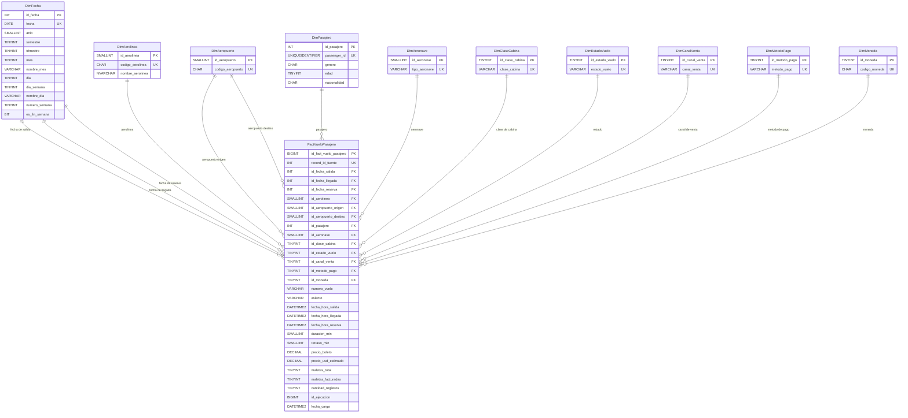

# Modelo dimensional en estrella

El modelo utiliza una tabla de hechos central, `FactVueloPasajero`, relacionada con diez dimensiones. `DimFecha` y `DimAeropuerto` se reutilizan mediante distintos roles para evitar duplicación de estructuras.

## Grano

Una fila de `dw.FactVueloPasajero` representa un registro fuente de un pasajero asociado con una reserva y una ocurrencia de vuelo.

Por esta razón, un `COUNT(*)` sobre la tabla de hechos debe interpretarse como cantidad de registros pasajero-vuelo y no necesariamente como cantidad de vuelos físicos distintos.
