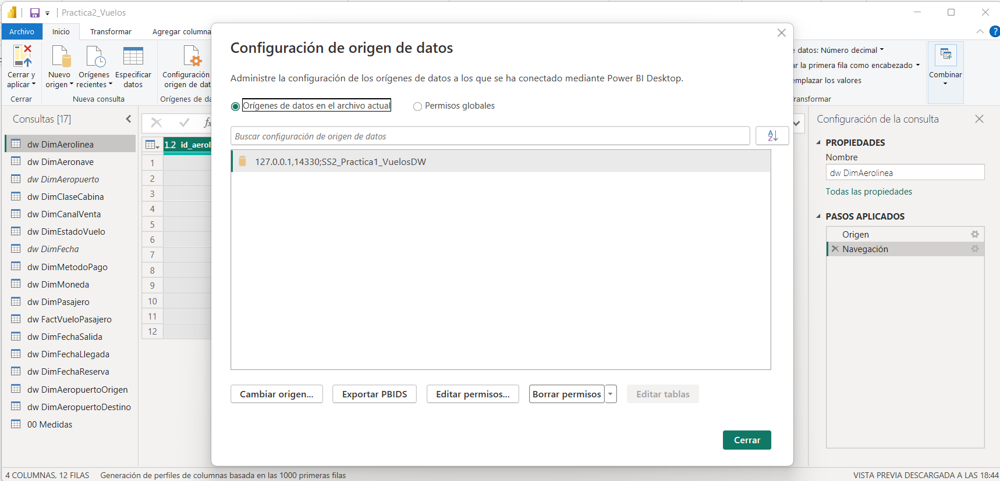
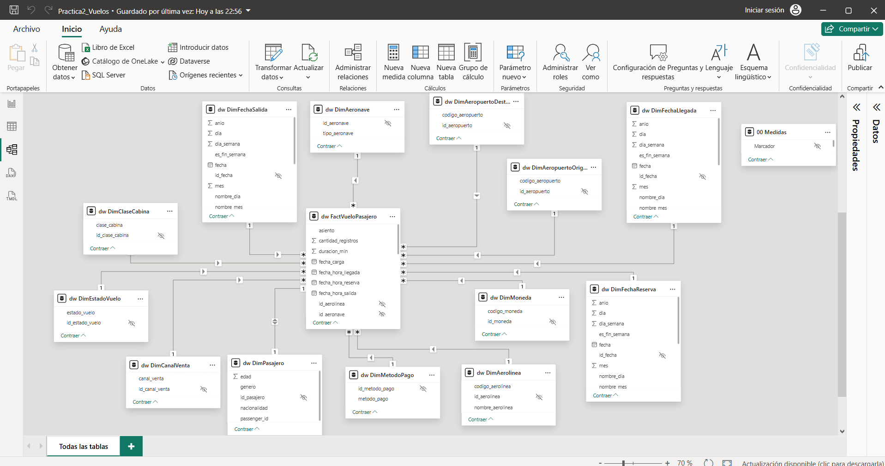
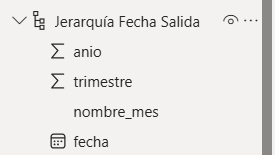
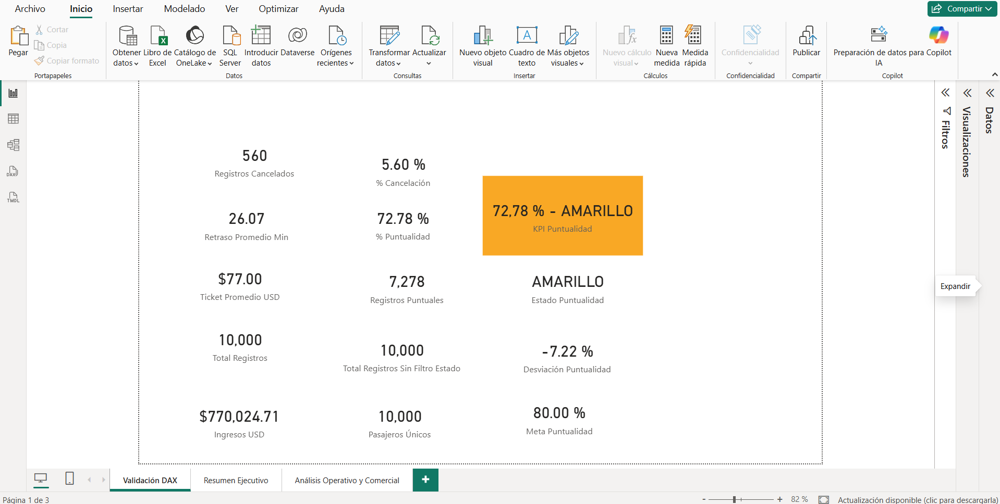
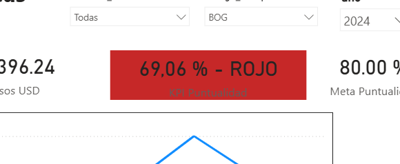
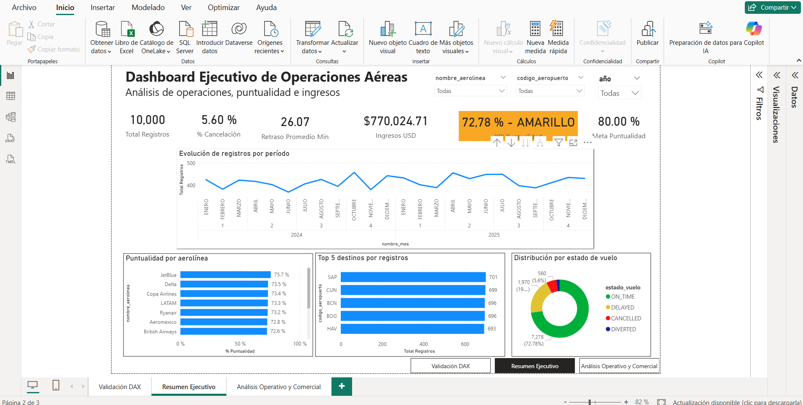
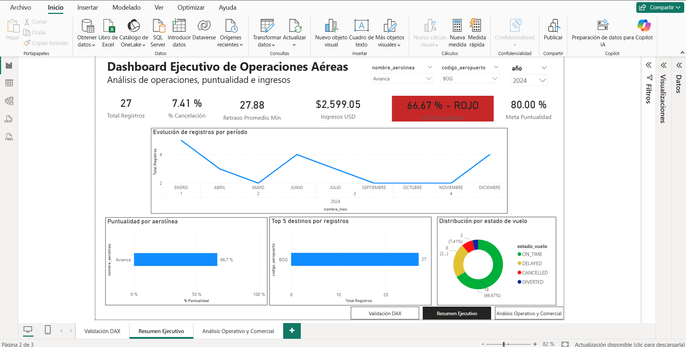
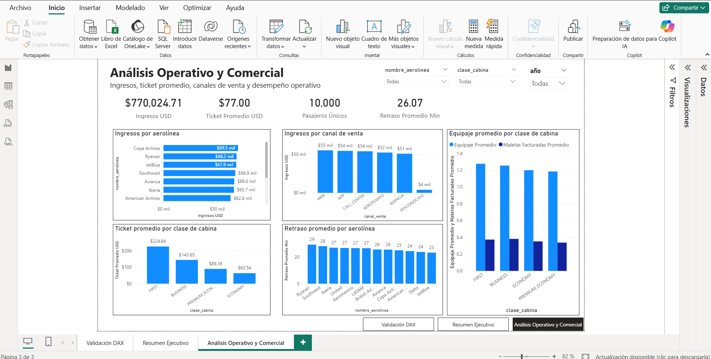

# Práctica 2 — Dashboard Ejecutivo de Operaciones Aéreas

## 1. Descripción general

Esta práctica consiste en diseñar un modelo tabular y un dashboard interactivo en Power BI para analizar operaciones aéreas. El reporte transforma los datos almacenados en un Data Warehouse de SQL Server en indicadores sobre registros, ingresos, puntualidad, cancelaciones y retrasos.

El dashboard tiene una orientación ejecutiva: presenta los indicadores principales en la parte superior y permite analizar la operación por período, aerolínea, destino y estado de vuelo.

## 2. Objetivo

Construir un dashboard interactivo en Power BI, conectado a SQL Server, que permita analizar el desempeño de las operaciones aéreas mediante un modelo dimensional, medidas DAX, un KPI semaforizado y visualizaciones interactivas.

Los objetivos específicos son:

- Conectar Power BI Desktop con la base de datos en SQL Server.
- Implementar un modelo tabular con una tabla de hechos y dimensiones relacionadas.
- Crear medidas DAX para resumir indicadores operativos y financieros.
- Evaluar la puntualidad respecto de una meta interna.
- Facilitar el análisis por año, aerolínea, destino y estado de vuelo.

## 3. Fuente de datos y conexión

- **Motor de base de datos:** SQL Server.
- **Base de datos:** `SS2_Practical_VuelosDW`.
- **Herramienta de visualización:** Power BI Desktop.
- **Modo de carga:** Importación de tablas desde SQL Server hacia Power BI.

La información proviene de un Data Warehouse de operaciones aéreas. El modelo reúne registros de vuelos y pasajeros, junto con dimensiones de aerolíneas, aeronaves, aeropuertos, fechas, estados de vuelo, canal de venta, clase de cabina, método de pago y moneda.





## 4. Modelo tabular

El reporte utiliza un enfoque dimensional. La tabla de hechos concentra los registros operativos y las dimensiones aportan el contexto para filtrarlos y analizarlos.

### 4.1 Tabla de hechos

La tabla central identificada es:

- `dw.FactVueloPasajero`

Su grano corresponde a un registro de vuelo-pasajero.

### 4.2 Dimensiones identificadas

- `dw.DimAerolinea`
- `dw.DimAeronave`
- `dw.DimAeropuertoDestino`
- `dw.DimAeropuertoOrigen`
- `dw.DimCanalVenta`
- `dw.DimClaseCabina`
- `dw.DimEstadoVuelo`
- `dw.DimFechaLlegada`
- `dw.DimFechaReserva`
- `dw.DimFechaSalida`
- `dw.DimMetodoPago`
- `dw.DimMoneda`

Estas dimensiones permiten analizar la información por operador aéreo, aeronave, origen, destino, período, estado del vuelo y características comerciales.

### 4.3 Relaciones del modelo

El modelo se plantea como un esquema estrella. Las dimensiones se conectan con la tabla de hechos mediante sus claves correspondientes, con relaciones de uno a muchos desde las dimensiones hacia los hechos. Este diseño permite que los filtros seleccionados en las dimensiones afecten de forma consistente las medidas y visualizaciones.

La captura de la vista Modelo se agregará posteriormente para evidenciar las relaciones, cardinalidades y direcciones de filtro configuradas.




### 4.4 Jerarquías

Para el análisis temporal se utiliza una jerarquía con la estructura:

`Año > Trimestre > Mes > Día`

Esta jerarquía permite navegar desde un período general hacia un nivel de mayor detalle mediante *drill down*. El año se utiliza como segmentador y los meses se muestran en el gráfico de evolución.




## 5. Medidas DAX

Las medidas se crearon en la tabla auxiliar `00 Medidas`. Las fórmulas siguientes corresponden a la configuración documentada. Las medidas de porcentaje utilizan `Total Registros Sin Filtro Estado` como denominador para que un filtro de estado no distorsione el total de comparación, mientras se conservan filtros como año, aerolínea, origen y destino.

### 5.1 Total Registros

Esta medida cuenta los registros de la tabla de hechos bajo el contexto de filtros vigente.

```dax
Total Registros =
COUNTROWS('dw FactVueloPasajero')
```

> Si la fórmula guardada en Power BI difiere de esta expresión, debe copiarse aquí exactamente desde la página de validación DAX.

### 5.2 Ingresos USD

Suma el precio estimado en dólares de los registros analizados.

```dax
Ingresos USD =
SUM('dw FactVueloPasajero'[precio_usd_estimado])
```

Formato aplicado: moneda, símbolo `$`, dos decimales y unidades de visualización `Ninguno`.

### 5.3 Ticket Promedio USD

Calcula el ingreso promedio por registro.

```dax
Ticket Promedio USD =
DIVIDE(
    [Ingresos USD],
    [Total Registros],
    0
)
```

Formato aplicado: moneda, símbolo `$`, dos decimales y unidades `Ninguno`.

### 5.4 Retraso Promedio Min

Calcula el promedio de minutos de retraso. `AVERAGE()` ignora los valores en blanco; por ello, los registros cancelados con retraso nulo no se convierten incorrectamente en retrasos de cero.

```dax
Retraso Promedio Min =
AVERAGE('dw FactVueloPasajero'[retraso_min])
```

Formato aplicado: número decimal con dos decimales.

### 5.5 Pasajeros Únicos

Cuenta los pasajeros distintos registrados.

```dax
Pasajeros Únicos =
DISTINCTCOUNT(
    'dw FactVueloPasajero'[id_pasajero]
)
```

Formato aplicado: número entero, sin unidades de visualización.

### 5.6 Total Registros Sin Filtro Estado

Calcula el total sin considerar filtros provenientes de la dimensión de estado del vuelo.

```dax
Total Registros Sin Filtro Estado =
CALCULATE(
    [Total Registros],
    REMOVEFILTERS('dw DimEstadoVuelo')
)
```

### 5.7 Registros Puntuales

Cuenta los registros cuyo estado es `ON_TIME`.

```dax
Registros Puntuales =
CALCULATE(
    [Total Registros],
    'dw DimEstadoVuelo'[estado_vuelo] = "ON_TIME"
)
```

### 5.8 Porcentaje de Puntualidad

Calcula la proporción de registros puntuales respecto del total sin filtro de estado.

```dax
% Puntualidad =
DIVIDE(
    [Registros Puntuales],
    [Total Registros Sin Filtro Estado],
    0
)
```

Formato aplicado: porcentaje con dos decimales.

### 5.9 Registros Cancelados

Cuenta los registros cuyo estado es `CANCELLED`.

```dax
Registros Cancelados =
CALCULATE(
    [Total Registros],
    'dw DimEstadoVuelo'[estado_vuelo] = "CANCELLED"
)
```

### 5.10 Porcentaje de Cancelación

Calcula la proporción de registros cancelados respecto del total sin filtro de estado.

```dax
% Cancelación =
DIVIDE(
    [Registros Cancelados],
    [Total Registros Sin Filtro Estado],
    0
)
```

Formato aplicado: porcentaje con dos decimales.




## 6. Validación de resultados

Los resultados dependen de los filtros activos. Por esta razón, se distinguen dos contextos de validación:

### 6.1 Validación global del modelo

La configuración documentada de las medidas fue validada con el conjunto global de datos y produjo los siguientes valores:

| Indicador | Resultado global |
|---|---:|
| Total Registros | 10,000 |
| Ticket Promedio USD | Aproximadamente `$77.00` |
| Retraso Promedio Min | `26.07` |
| Pasajeros Únicos | 10,000 |
| Registros Cancelados | 560 |
| Porcentaje de Cancelación | `5.60 %` |
| Porcentaje de Puntualidad | `72.78 %` |

El porcentaje de cancelación global se obtiene de la relación:

$$
\frac{560}{10,000} = 0.056 = 5.60\%
$$

### 6.2 Contexto mostrado en el dashboard

En la captura del dashboard se encuentra seleccionado el año `2024`. Bajo ese filtro se observan los siguientes valores:

| Indicador | Resultado con filtro 2024 |
|---|---:|
| Total Registros | 4,927 |
| Porcentaje de Cancelación | 5.44 % |
| Retraso Promedio Min | 24.98 |
| Ingresos USD | $385,334.71 |
| Porcentaje de Puntualidad | 73.19 % |
| Meta de Puntualidad | 80.00 % |

Las diferencias entre los valores globales y los valores de la captura son esperadas, porque las medidas responden al contexto de filtro aplicado en Power BI.

## 7. KPI de puntualidad y semaforización

### 7.1 Métrica y meta

El KPI evalúa el porcentaje de registros puntuales respecto del total de registros sin filtro de estado.

La meta es una regla interna definida para esta solución analítica; no se presenta como un estándar externo de la industria.

```dax
Meta Puntualidad =
0.80
```

Formato aplicado: porcentaje con dos decimales.

### 7.2 Desviación respecto de la meta

```dax
Desviación Puntualidad =
[% Puntualidad] - [Meta Puntualidad]
```

Con el valor global de 72.78 %, la desviación aproximada es `-7.22 %`.

### 7.3 Estado del KPI

Se definieron las siguientes bandas internas:

- **Verde:** puntualidad mayor o igual que 80 %.
- **Amarillo:** puntualidad mayor o igual que 70 % y menor que 80 %.
- **Rojo:** puntualidad menor que 70 %.

```dax
Estado Puntualidad =
SWITCH(
    TRUE(),
    [% Puntualidad] >= 0.80, "VERDE",
    [% Puntualidad] >= 0.70, "AMARILLO",
    "ROJO"
)
```

### 7.4 Color dinámico

La siguiente medida se utiliza para aplicar formato condicional al fondo de la tarjeta del KPI:

```dax
Color Puntualidad =
SWITCH(
    [Estado Puntualidad],
    "VERDE", "#2E7D32",
    "AMARILLO", "#F9A825",
    "ROJO", "#C62828",
    "#808080"
)
```

### 7.5 Etiqueta del KPI

```dax
KPI Puntualidad =
FORMAT(
    [% Puntualidad],
    "0.00 %"
)
    & " - "
    & [Estado Puntualidad]
```

En el contexto global, la etiqueta esperada es `72.78 % - AMARILLO`. En el contexto del dashboard filtrado por 2024, la tarjeta muestra `73.19 % - AMARILLO`.

La tarjeta del KPI utiliza `Color Puntualidad` como valor de campo para el formato condicional del fondo. También se muestra una tarjeta independiente con `Meta Puntualidad = 80.00 %`.



## 8. Diseño del dashboard

La página principal se titula **“Dashboard Ejecutivo de Operaciones Aéreas”** y contiene el subtítulo **“Análisis de operaciones, puntualidad e ingresos”**.

### 8.1 Segmentadores y filtros

El dashboard incorpora un segmentador de año. En la evidencia disponible se encuentra seleccionado `2024`. Las visualizaciones se actualizan de acuerdo con el contexto seleccionado.

El modelo también permite ampliar el análisis por aerolínea, aeropuerto de origen, aeropuerto de destino, estado del vuelo, fecha, canal de venta, clase de cabina, método de pago y moneda.

### 8.2 Tarjetas de indicadores

En la captura del dashboard se observan:

- Total de registros: `4,927`.
- Porcentaje de cancelación: `5.44 %`.
- Retraso promedio: `24.98` minutos.
- Ingresos: `USD 385,334.71`.
- KPI de puntualidad: `73.19 % — AMARILLO`.
- Meta de puntualidad: `80.00 %`.

### 8.3 Visualizaciones implementadas

#### Evolución de registros por período

Gráfico de líneas que muestra la variación mensual del total de registros. Permite identificar meses con mayor o menor actividad.

#### Puntualidad por aerolínea

Gráfico de barras horizontales que compara el porcentaje de puntualidad entre aerolíneas. Facilita el reconocimiento de diferencias de desempeño entre operadores.

#### Top 5 destinos por registros

Gráfico de barras horizontales que presenta los cinco destinos con mayor cantidad de registros. Permite identificar los destinos con mayor concentración operativa.

#### Distribución por estado de vuelo

Gráfico de anillo que resume la composición de los registros por estado. En la evidencia se observan las categorías `ON_TIME`, `DELAYED`, `CANCELLED` y `DIVERTED`.




## 9. Interpretación estratégica

El dashboard permite apoyar decisiones operativas y comerciales:

- El KPI de puntualidad permite monitorear si la operación alcanza la meta definida. Tanto el resultado global de `72.78 %` como el resultado filtrado de 2024 de `73.19 %` se encuentran por debajo del objetivo de `80.00 %`, por lo que se clasifican como amarillos.
- El porcentaje de cancelación permite observar la incidencia de vuelos cancelados respecto del volumen total.
- El retraso promedio aporta una medida del impacto de las demoras en la operación.
- La evolución mensual ayuda a detectar variaciones de actividad durante el año.
- La comparación por aerolínea permite identificar diferencias de puntualidad.
- El ranking de destinos ayuda a reconocer los puntos con mayor actividad.
- La distribución por estado resume la proporción de operaciones puntuales, demoradas, canceladas o desviadas.
- Los ingresos y el ticket promedio incorporan la perspectiva financiera al análisis operativo.

Estos indicadores permiten priorizar investigaciones y acciones de mejora, pero no determinan por sí solos las causas de los retrasos o cancelaciones.



## 10. Conclusiones

Se desarrolló un dashboard interactivo en Power BI conectado a un Data Warehouse de SQL Server. El reporte integra indicadores operativos y financieros, medidas DAX, un KPI con meta y semaforización, segmentadores y visualizaciones de análisis.

La meta de puntualidad fue definida internamente en 80 %. Los resultados documentados muestran un desempeño inferior a la meta, tanto en la validación global como en el contexto filtrado por 2024. Esto demuestra la utilidad del semáforo para identificar rápidamente una situación que requiere seguimiento.

El modelo dimensional y las medidas DAX permiten que el dashboard responda dinámicamente a los filtros, facilitando el análisis desde una perspectiva ejecutiva.


