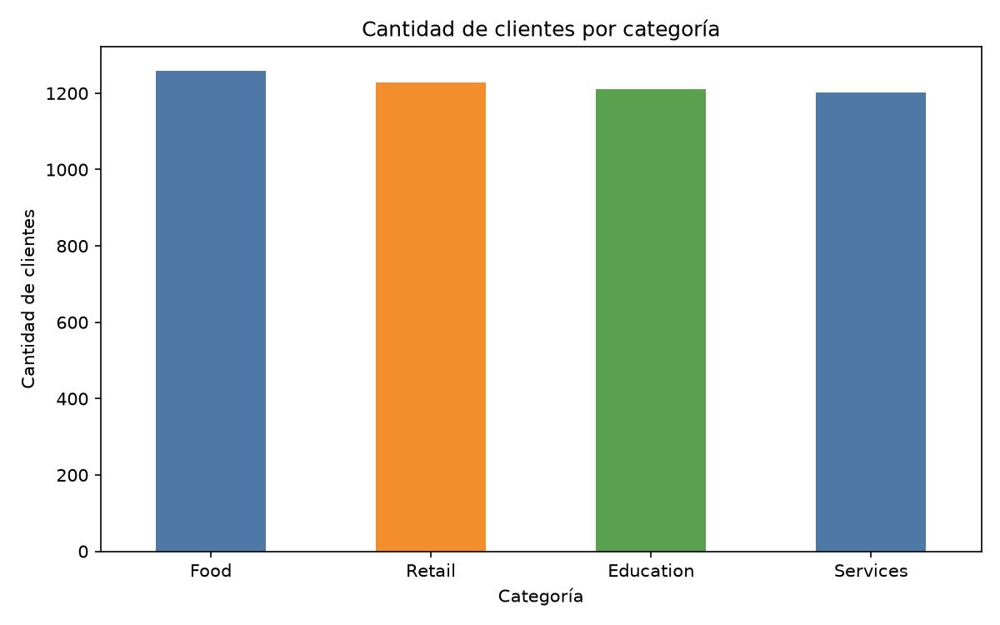
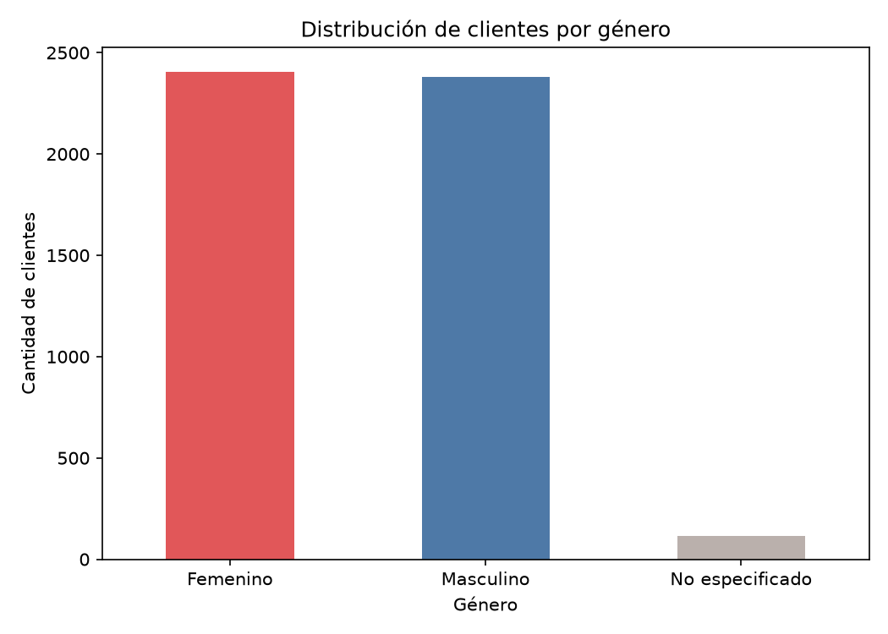
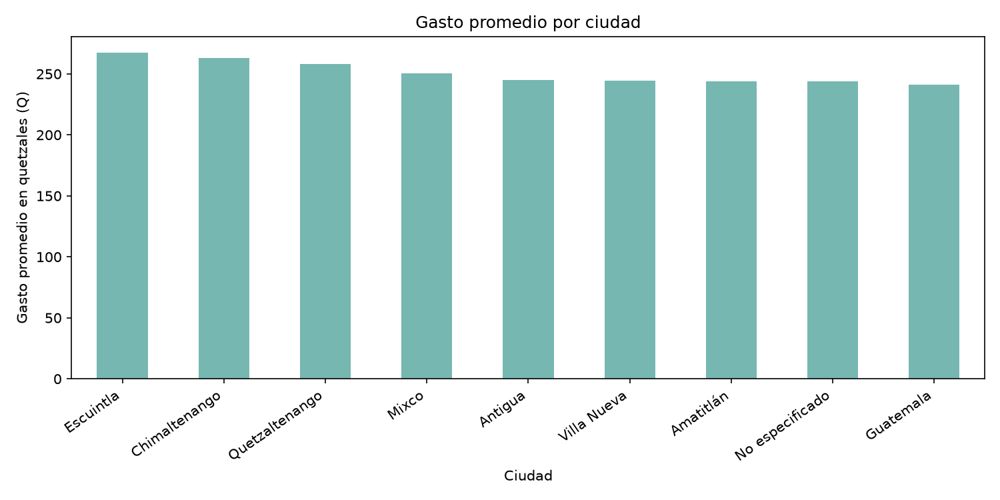

# Limpieza y estandarización de dataset de clientes

## Nombre del dataset utilizado

**Dataset:** `dataset_sucio.csv`

El dataset contiene información de clientes, incluyendo las siguientes variables:

- `id_cliente`: identificador único de cada cliente.
- `nombre`: nombre del cliente.
- `genero`: género registrado.
- `fecha_registro`: fecha de registro del cliente.
- `gasto_q`: gasto del cliente expresado en quetzales.
- `ciudad`: ciudad de residencia o registro.
- `categoria`: categoría asociada al cliente.

El archivo original contiene más de 5,000 registros y presenta problemas de calidad de datos, como duplicados, valores vacíos, diferencias de formato, espacios innecesarios y registros escritos con mayúsculas y minúsculas inconsistentes.

## Objetivo

Aplicar un proceso de limpieza de datos con Python para obtener un dataset más consistente, estructurado y listo para análisis.

## Herramientas utilizadas

- Python
- Pandas
- Matplotlib
- CSV

## Proceso de limpieza aplicado

### 1. Eliminación de duplicados

Se realizaron dos validaciones de duplicados:

1. Se eliminaron las filas completamente repetidas.
2. Se eliminaron los registros con un mismo `id_cliente`, conservando únicamente la primera aparición de cada cliente.

Esto permite evitar que un cliente sea contabilizado más de una vez durante el análisis.

### 2. Tratamiento de celdas vacías

Se identificaron valores vacíos en distintas columnas del dataset.

Las acciones aplicadas fueron:

- En las columnas de texto, los valores vacíos se reemplazaron por `No especificado`.
- Las fechas faltantes se reemplazaron por la fecha más frecuente del dataset, cuando fue posible calcularla.
- Los valores faltantes en `gasto_q` se reemplazaron con la mediana de gasto de la categoría correspondiente.
- En caso de que no existiera una mediana por categoría, se utilizó la mediana general del gasto.

La mediana se utilizó porque es menos sensible a valores extremos que el promedio.

### 3. Estandarización de valores y formatos

Se aplicaron las siguientes transformaciones:

- Se eliminaron espacios adicionales al inicio, final y dentro de los valores textuales.
- Los nombres fueron convertidos al formato de título, por ejemplo: `ANA DIAZ` pasó a `Ana Diaz`.
- Los valores de género como `m`, `M`, `f` y `F` se unificaron como `Masculino` y `Femenino`.
- Las fechas fueron convertidas al formato uniforme `YYYY-MM-DD`.
- Los valores de gasto que usaban coma decimal, como `373,33`, se transformaron a valores numéricos con punto decimal: `373.33`.
- Las ciudades se normalizaron, por ejemplo: `quetzaltenango` pasó a `Quetzaltenango`.
- Las categorías se estandarizaron con formato consistente, por ejemplo: `retail`, `RETAIL` y `Retail` pasaron a `Retail`.

## Archivos generados

Después de ejecutar el script `limpieza_dataset.py`, se generan los siguientes archivos:

### Clientes por categoría

### Clientes por género

### Gasto promedio por ciudad
