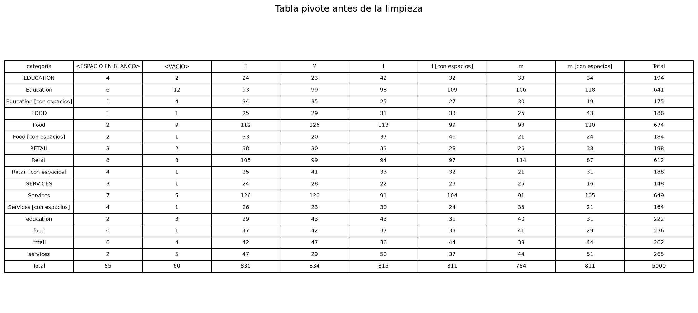
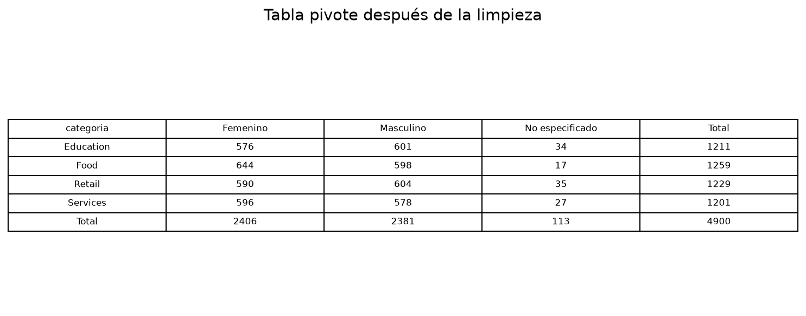

# Limpieza y estandarización de dataset de clientes

## Nombre del dataset utilizado

**Dataset:** `dataset_sucio.csv`

El dataset contiene información de clientes, incluyendo las siguientes variables:

* `id_cliente`: identificador único de cada cliente.
* `nombre`: nombre del cliente.
* `genero`: género registrado.
* `fecha_registro`: fecha de registro del cliente.
* `gasto_q`: gasto del cliente expresado en quetzales.
* `ciudad`: ciudad de residencia o registro.
* `categoria`: categoría asociada al cliente.

El archivo original contiene 5,000 registros y presenta problemas de calidad de datos, como duplicados, valores vacíos, diferencias de formato, espacios innecesarios y registros escritos con mayúsculas y minúsculas inconsistentes.

## Objetivo

Aplicar un proceso de limpieza de datos con Python para obtener un dataset más consistente, estructurado y listo para análisis.

## Herramientas utilizadas

* Python
* Pandas
* Matplotlib
* CSV

## Proceso de limpieza aplicado

### 1. Eliminación de duplicados

Se realizaron dos validaciones de duplicados:

1. Se eliminaron las filas completamente repetidas.
2. Se eliminaron los registros con un mismo `id_cliente`, conservando únicamente la primera aparición de cada cliente.

Esto permite evitar que un cliente sea contabilizado más de una vez durante el análisis.

### 2. Tratamiento de celdas vacías

Se identificaron valores vacíos en distintas columnas del dataset.

Las acciones aplicadas fueron:

* En las columnas de texto, los valores vacíos se reemplazaron por `No especificado`.
* Las fechas se convirtieron a un formato uniforme. En caso de encontrarse una fecha faltante o un valor que no pueda interpretarse correctamente, el script utiliza la fecha más frecuente del dataset como mecanismo de imputación, siempre que sea posible calcularla.
* Los valores faltantes en `gasto_q` se reemplazaron con la mediana de gasto de la categoría correspondiente.
* En caso de que no existiera una mediana por categoría, se utilizó la mediana general del gasto.

La mediana se utilizó porque es menos sensible a valores extremos que el promedio.

### 3. Estandarización de valores y formatos

Se aplicaron las siguientes transformaciones:

* Se eliminaron espacios adicionales al inicio, final y dentro de los valores textuales.
* Los nombres fueron convertidos al formato de título, por ejemplo: `ANA DIAZ` pasó a `Ana Diaz`.
* Los valores de género como `m`, `M`, `f` y `F` se unificaron como `Masculino` y `Femenino`.
* Las fechas fueron convertidas al formato uniforme `YYYY-MM-DD`.
* Los valores de gasto que usaban coma decimal, como `373,33`, se transformaron a valores numéricos con punto decimal: `373.33`.
* Las ciudades se normalizaron, por ejemplo: `quetzaltenango` pasó a `Quetzaltenango`.
* Las categorías se estandarizaron con formato consistente, por ejemplo: `retail`, `RETAIL` y `Retail` pasaron a `Retail`.

## Comparación antes y después de la limpieza

Para comprobar el efecto del proceso de limpieza se conservaron los datos originales antes de realizar las transformaciones y se compararon con el dataset resultante.

| Indicador                               | Antes de la limpieza | Después de la limpieza |
| --------------------------------------- | -------------------: | ---------------------: |
| Cantidad de registros                   |                5,000 |                  4,900 |
| Filas duplicadas                        |                  100 |                      0 |
| IDs de cliente repetidos                |                  100 |                      0 |
| Celdas nulas                            |                  722 |                      0 |
| Representaciones distintas de categoría |                   16 |                      4 |
| Representaciones distintas de género    |                    8 |                      3 |

La reducción de 5,000 a 4,900 registros corresponde a la eliminación de 100 registros duplicados. Asimismo, después del tratamiento de valores faltantes no quedaron celdas nulas en el dataset depurado.

La estandarización también redujo las diferentes representaciones de las categorías de 16 a 4 valores consistentes: `Education`, `Food`, `Retail` y `Services`. De manera similar, los valores asociados al género quedaron consolidados en `Femenino`, `Masculino` y `No especificado`.

### Tabla pivote antes de la limpieza

La siguiente tabla muestra la distribución de clientes según categoría y género antes del proceso de limpieza.

Antes del tratamiento puede observarse que una misma categoría aparece representada de diferentes maneras debido al uso inconsistente de mayúsculas, minúsculas y espacios. El mismo problema ocurre con los valores de género, provocando que registros que conceptualmente pertenecen al mismo grupo aparezcan separados.

Por ejemplo, valores como `Education`, `EDUCATION` y `education` son tratados inicialmente como grupos diferentes. También existen registros que contienen espacios adicionales. La tabla permite visualizar claramente cómo estas inconsistencias afectan la agrupación de la información.

### Tabla pivote después de la limpieza

Después de aplicar las transformaciones se generó nuevamente la misma tabla pivote.

Después de la limpieza las categorías quedan consolidadas en cuatro grupos y los valores de género en tres grupos consistentes. Esto permite realizar análisis más confiables, ya que registros equivalentes dejan de contabilizarse como categorías diferentes debido únicamente a problemas de formato.

La tabla resultante también permite observar que la distribución de clientes es relativamente equilibrada entre las cuatro categorías y entre los géneros femenino y masculino. Los registros cuyo género no estaba disponible fueron conservados bajo la categoría `No especificado` en lugar de eliminar información válida.

## Archivos generados

Después de ejecutar el script `limpieza_dataset.py`, los resultados se almacenan en la carpeta `resultados`.

Los principales archivos generados son:

* `dataset_limpio.csv`: dataset final después del proceso de limpieza.
* `reporte_limpieza.csv`: resumen cuantitativo de los cambios aplicados.
* `tabla_pivote_antes.csv`: tabla pivote generada con los datos antes de la limpieza.
* `tabla_pivote_despues.csv`: tabla pivote generada con los datos depurados.
* `tabla_pivote_antes.png`: representación visual de la tabla pivote original.
* `tabla_pivote_despues.png`: representación visual de la tabla pivote final.
* `clientes_por_categoria.png`: gráfica de clientes agrupados por categoría.
* `clientes_por_genero.png`: gráfica de clientes agrupados por género.
* `gasto_promedio_por_ciudad.png`: gráfica del gasto promedio de los clientes por ciudad.

## Visualizaciones e interpretación de resultados

### Clientes por categoría

La distribución de los clientes entre las categorías es bastante equilibrada. `Food` presenta la mayor cantidad con 1,259 clientes, seguida de `Retail` con 1,229, `Education` con 1,211 y `Services` con 1,201. Las diferencias son reducidas, por lo que ninguna categoría concentra una proporción excesivamente alta de los registros.

### Clientes por género

Después de la estandarización se identificaron 2,406 clientes registrados como `Femenino`, 2,381 como `Masculino` y 113 como `No especificado`. Esto muestra una distribución prácticamente equilibrada entre los géneros femenino y masculino. Los valores que originalmente estaban vacíos o no podían clasificarse de forma confiable se conservaron como `No especificado`.

### Gasto promedio por ciudad

El gasto promedio más alto corresponde a Escuintla, con aproximadamente Q267.41 por cliente, seguido por Chimaltenango con Q263.22 y Quetzaltenango con Q258.28. Guatemala presenta el menor promedio entre las ciudades identificadas, con aproximadamente Q241.11.

Aunque existen diferencias entre ciudades, los valores se mantienen dentro de un intervalo relativamente cercano, por lo que no se observa una ciudad que se aleje de manera extrema del comportamiento general.

## Conclusión

El proceso aplicado permitió transformar el dataset original en una fuente de información más consistente y adecuada para el análisis. Se eliminaron registros duplicados, se trataron los valores faltantes y se estandarizaron textos, fechas, ciudades, categorías, géneros y valores monetarios.

La comparación entre las tablas pivote antes y después de la limpieza evidencia el impacto de estas transformaciones: valores que originalmente representaban una misma categoría aparecían separados debido a diferencias de formato, mientras que en el dataset depurado se encuentran consolidados.

Como resultado, los análisis y visualizaciones posteriores pueden interpretarse con mayor confiabilidad, ya que la información se encuentra estructurada de forma consistente y sin registros duplicados ni valores nulos.
